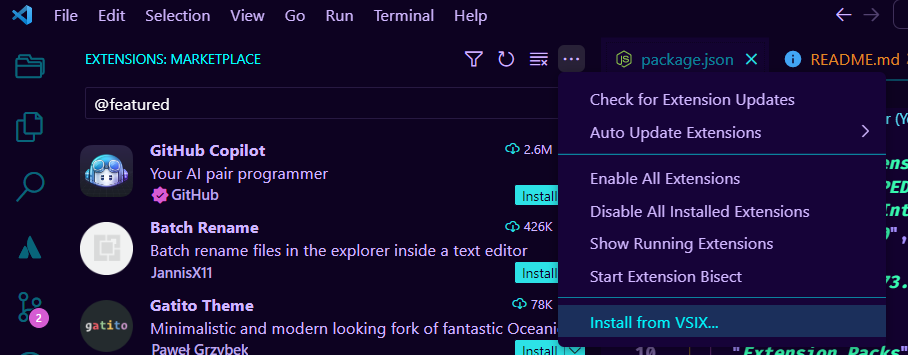

# ped-extension-pack README

## Included Extensions

* [Code Spell Checker](https://marketplace.visualstudio.com/items?itemName=streetsidesoftware.code-spell-checker)
* [Docker](https://marketplace.visualstudio.com/items?itemName=ms-azuretools.vscode-docker)
* [DotENV](https://marketplace.visualstudio.com/items?itemName=mikestead.dotenv)
* [ESLint](https://marketplace.visualstudio.com/items?itemName=dbaeumer.vscode-eslint)
* [Git Extension Pack](https://marketplace.visualstudio.com/items?itemName=donjayamanne.git-extension-pack)
* [GitHub Pull Requests and Issues](https://marketplace.visualstudio.com/items?itemName=GitHub.vscode-pull-request-github&ssr=false#review-details)
* [Jira and Bitbucket (Atlassian Labs)](https://marketplace.visualstudio.com/items?itemName=Atlassian.atlascode)
* [Live Share Extension Pack](https://marketplace.visualstudio.com/items?itemName=MS-vsliveshare.vsliveshare-pack)
* [Material Icon Theme](https://marketplace.visualstudio.com/items?itemName=PKief.material-icon-theme)
* [Node.js Extension Pack](https://marketplace.visualstudio.com/items?itemName=waderyan.nodejs-extension-pack)
* [PHP Debug](https://marketplace.visualstudio.com/items?itemName=xdebug.php-debug)
* [PHP Intelephense](https://marketplace.visualstudio.com/items?itemName=bmewburn.vscode-intelephense-client)
* [Prettier - Code Formatter](https://marketplace.visualstudio.com/items?itemName=esbenp.prettier-vscode)
* [Web Accessibility](https://marketplace.visualstudio.com/items?itemName=MaxvanderSchee.web-accessibility)

## Installation

* Download the **.vsix** file
* Within VSCode, open the Extensions View, click the ... menu, and select "Install from VSIX..."

* Browse to the downloaded .vsix file and click the **Install** button

## Compiling Yourself

If you want to compile the VSIX file on your own, follow these steps.

1. If adding packages:
    1. Add the package's unique identifier to the package.json file under "extensionPack" (unique identifier found on the extension's Marketplace page)
    1. Update the package.json file's version properly accordingly
    1. Update this README with the package name and Marketplace link
1. Run the following commands to generate a new VSIX file:

    ```powershell
    npm install
    ```

    ```powershell
    npx vsce package
    ```

**Enjoy!**
